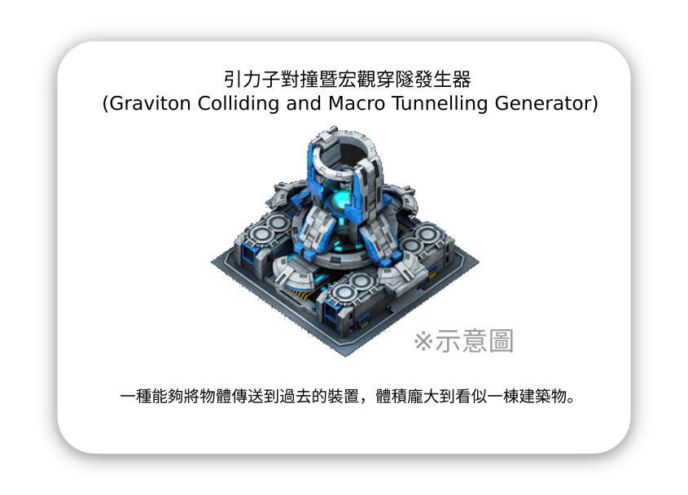

# 震懾行動 (Shock Ops) 遊戲概念筆記

自從看完電影「天能」之後，「能否弄出跟穿越時空有關遊戲？」的想法就一直在我心裡揮之不去。後來概念慢慢成型，即時戰略遊戲、超級武器、因果修正等等概念慢慢連線在一起，整個概念也逐漸清晰，不過依然停留在一個基本遊戲機制「可以摧毀敵人過去的建築修改因果律」，而沒有具體細節。直到前幾天 (2021-04-28) 洗澡的時候突然靈感一來，想出幾個自圓其說的背景設定以及機制的細節讓遊戲變得豐富。

## 設定

整個遊戲的背景設定圍繞在這三個名詞：

- 引力子對撞暨宏觀穿隧發生器 (Graviton Colliding and Macro Tunnelling  Generator)
    - 一種能夠將物體傳送到過去的裝置，體積龐大，基本形同建築物。
- 時空炸彈
    - 透過引力子對撞暨宏觀穿隧發生器傳送的物質會在原子尺度變得極度不穩定，最終透過傳送爆裂物而將該技術實用化。
- 時空震懾效應
    - 當過去的事物被時空炸彈破壞，當下的時間會發生因果修正，因果被消滅的事物會消失，因果被拯救的事物會復甦。

## 時空炸彈

遊戲機制（因果修正）規則大致如下：

- 被時空炸彈消滅的敵方單位，其單位曾經擊殺的我方單位會於死亡時的位置原地復活。
- 被時空炸彈消滅的敵方設施，其衍生物視同被時空炸彈消滅。
- 被時空炸彈消滅的我方單位或設施適用相同規則。

殺掉殺掉我的單位的敵人，我的單位就會活著，基本上當成魔鬼終結者的世界來理解應該不會太難。時間線中虛線的部份代表玩家的主觀體驗不會經歷到，單位突然從現在出現或消失都是時空震懾效應造成的：

因果修正同樣適用衍生物，用星海爭霸 2 比喻的話就是，當我把造了虛空艦的星際之門摧毀，那麼被虛空艦擊殺的單位就沒有被擊殺過，因此原地復活。

更進一步的說，也就是如果摧毀了遊戲開始時的星核，則會大幅改寫當下遊戲雙方的勢力。

## 引力子對撞暨宏觀穿隧發生器

引力子對撞暨宏觀穿隧發生器，以下簡稱設施。設施分為三種：

### P 型

P 源自電影的 Primer。

- 穿越成本較低
- 穿越幅度僅到設施建造完成的時間。

### T 型

T 源自電影的 TENET。

- 穿越成本較高
- 穿越幅度為建築物存在時間（存在越久，穿越幅度越大）

### A 型

- 穿越成本與穿越幅度相關（暫定與距離平方成正比）
- 無穿越幅度限制

### 傳送中繼

只要付出穿越成本，便可以使用過去曾經建造過得設施，即便該設施在現在已經被摧毀。穿越距離依然受到該設施種類限制。透過傳送中繼打擊初始狀態的敵人主建築算是本遊戲的主要勝利條件之一。

## 時空屏障

考量到遊戲平衡似乎應該要有反制手段，但是其實上述的遊戲機制已經讓遊戲足夠複雜，不確定屏障的加入對遊戲是否有正面影響。

## 創用授權

除了單位圖片[^tank-img]、建築物圖片[^building-img]與爆炸畫面圖片[^plasma-bomb]，以外其他部份係採用[創用 CC 姓名標示-非商業性-相同方式分享 3.0 台灣 授權條款](http://creativecommons.org/licenses/by-nc-sa/3.0/tw/)授權。

[^tank-img]:https://pixelpaladin.itch.io/tiny-pixel-wars

[^building-img]:https://www.artstation.com/artwork/Lq5qP

[^plasma-bomb]:https://worldofweirdthings.com/2009/05/24/sci-fi-writers-hold-your-fire

###### tags: `idea note` `2021-04-28`

